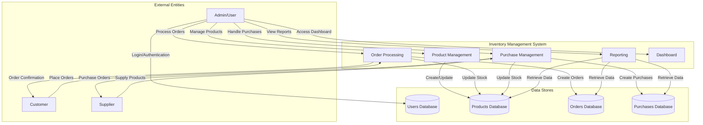

```mermaid
flowchart TB

%% Tata letak vertikal: entitas eksternal di atas, proses di tengah, data store di bawah

subgraph External_Entities["External Entities"]
direction TB
A[Admin/User]
B[Customer]
C[Supplier]
end

subgraph IMS["Inventory Management System"]
direction TB
P1[Product Management]
P2[Order Processing]
P3[Purchase Management]
P4[Reporting]
P5[Dashboard]
end

subgraph Data_Stores["Data Stores"]
direction TB
DS1[(Users Database)]
DS2[(Products Database)]
DS3[(Orders Database)]
DS4[(Purchases Database)]
end

%% Interaksi utama
A -->|Login/Authentication| DS1
A -->|Manage Products| P1
A -->|Process Orders| P2
A -->|Handle Purchases| P3
A -->|View Reports| P4
A -->|Access Dashboard| P5

B -->|Place Orders| P2
C -->|Supply Products| P3

P1 -->|Create/Update| DS2
P2 -->|Create Orders| DS3
P2 -->|Update Stock| DS2
P3 -->|Create Purchases| DS4
P3 -->|Update Stock| DS2
P4 -->|Retrieve Data| DS2
P4 -->|Retrieve Data| DS3
P4 -->|Retrieve Data| DS4

P2 -->|Order Confirmation| B
P3 -->|Purchase Orders| C
```
